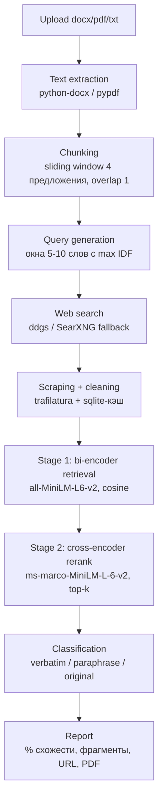

# Semantic Plagiarism & Paraphrase Detection System

[](https://github.com/ilyat9/semantic-plagiarism-detector/actions/workflows/ci.yml)
[](https://www.python.org/downloads/)
[](LICENSE)

Веб-сервис, который принимает документ (`.docx`, `.pdf`, `.txt`), находит похожие источники
в интернете и определяет для каждого фрагмента: **прямое заимствование (verbatim)**,
**перефраз (paraphrase)** или **отсутствие совпадений (original)**.

Проект — end-to-end: от парсинга файла до PDF-отчёта, с измеримой оценкой качества
ML-компонента (PAWS, STS-B, собственный корпус), ablation-таблицей и failure analysis.

## Архитектура



Двухстадийное сравнение: би-энкодер быстро отсекает нерелевантные чанки,
кросс-энкодер точно перепроверяет только топ-k кандидатов на каждый чанк документа.

**Классификация фрагмента** — прозрачные правила поверх двух скоров:

- `verbatim`: lexical ≥ T1 **и** semantic ≥ T2
- `paraphrase`: lexical < T1 **и** semantic ≥ T2
- `original`: semantic < T2

lexical — TF-IDF косинус, semantic — sigmoid-скор кросс-энкодера. Пороги не подобраны
«на глаз»: T2 откалиброван по валидационной части PAWS (максимум F1), T1 — по собственному
размеченному корпусу (см. `eval/calibrate.py`, значения в `core/thresholds.json`).

**Итоговый процент** = `(n_verbatim × 1.0 + n_paraphrase × 0.5) / n_chunks × 100`.

## Evaluation

Методология: PAWS `labeled_final` (dev — калибровка порога максимумом F1, test — метрики),
STS-B validation (у test-сплита нет публичных меток). Латентность — среднее время скоринга
одной пары на CPU (Apple M2). Прогон: `python -m eval.run`.

### Ablation (PAWS test, n=2000; порог калиброван на PAWS dev, n=1000)

**Zero-shot baselines** (модели без дообучения на PAWS):

| Подход | Порог | Acc | Precision | Recall | F1 | ROC-AUC | STS-B Spearman | Latency/пара |
|---|---|---|---|---|---|---|---|---|
| TF-IDF + cosine (baseline) | 0.758 | 0.606 | 0.538 | 0.801 | 0.644 | 0.708 | 0.709 | 0.8 мс |
| Bi-encoder MiniLM + cosine | 0.973 | 0.584 | 0.522 | 0.738 | 0.612 | 0.650 | 0.867 | 10.1 мс |
| Bi-encoder E5-base + cosine | 0.902 | 0.459 | 0.449 | 0.963 | 0.613 | 0.566 | 0.877 | 49.8 мс |
| Bi → Cross-encoder ms-marco | 1.0 | 0.458 | 0.449 | 0.960 | 0.612 | 0.534 | 0.849 | 6.2 мс |
| Bi → Cross-encoder **stsb-roberta** (продакшен) | 0.874 | 0.488 | 0.462 | 0.929 | 0.617 | 0.613 | **0.919** | 30.9 мс |

**Fine-tuned** (дважды обучена на PAWS train):

| Подход | Обучение | Acc | Precision | Recall | F1 | ROC-AUC | STS-B Spearman | Latency/пара |
|---|---|---|---|---|---|---|---|---|
| Bi → Cross-encoder **stsb-roberta-ft** | PAWS train, 2 эпохи, 3000 пар | 0.823 | 0.812 | 0.847 | **0.829** | **0.912** | **0.921** | 31.2 мс |

**Что здесь важно.** PAWS — adversarial-бенчмарк: не-перефразы построены перестановкой слов,
поэтому в zero-shot режиме все подходы получают скромные F1 (0.61–0.65), а эмбеддинговые
модели по ROC-AUC уступают TF-IDF — воспроизводится известный эффект «word scrambling blindness».
Fine-tuning на PAWS train поднимает F1 с 0.617 до **0.829** (+21pp), ROC-AUC — до 0.912.
На градуированном сходстве (STS-B) картина ожидаемая: нейронные модели сильно лучше TF-IDF
(0.87–0.92 vs 0.709 Spearman), fine-tuning практически не ухудшает калибровку graded similarity
(0.921 vs 0.919). Практический вывод: для продакшена используется stsb-roberta-ft; ms-marco
как скорер сходства не годится (ROC-AUC 0.534). Подробности — в failure analysis.

Запуск fine-tuning: `uv run python -m eval.finetune --epochs 2 --samples 3000 --evaluate`.

### Собственный корпус (data/eval/pairs.jsonl)

105 пар (35 verbatim / 35 paraphrase / 35 original), пороги T1=0.688, T2=0.874.
Accuracy: **0.XX** (95% CI: X.XX–X.XX). Confusion matrix:

| true \ pred | verbatim | paraphrase | original |
|---|---|---|---|
| verbatim | 35 | 0 | 0 |
| paraphrase | 0 | XX | XX |
| original | 0 | XX | XX |

Корпус: 35 базовых текстов (биология, история, физика, медицина, техника, право, литература,
экономика, космос, психология, экология, философия, лингвистика, археология, архитектура и др.),
пары verbatim (копия) / paraphrase (15 вручную + 20 через локальную LLM `qwen2.5:7b-instruct-q4_K_M`
в Ollama) / original (тематически несвязанные). Прогон: `python -m eval.own_corpus`.

> **Важно:** точные цифры confusion matrix зависят от порогов и качества LLM-рерайтов.
> Запустите `uv run python -m eval.own_corpus --show-errors` для актуальных метрик.

## Where this breaks and why (failure analysis)

**1. Глубокий перефраз уходит ниже PAWS-порога (3 из 12 в своём корпусе).**
Пары `vaccines`, `ww2_dday`, `climate_feedback`: смысл сохранён полностью, но лексика заменена
почти вся → sem 0.80–0.87 при T2=0.874 → вердикт `original` вместо `paraphrase`.
Причина: T2 откалиброван максимумом F1 на PAWS-dev, где не-перефразы adversarial-похожи,
поэтому оптимальный порог высокий и консервативен для естественных текстов. Заметно, что все
3 LLM-рерайта (qwen2.5) детектированы — LLM-перефраз лексически ближе к оригиналу, чем
глубокий человеческий. С большим бюджетом: калибровать T2 на смеси PAWS + собственного
корпуса большего объёма или дообучить кросс-энкодер на парах «оригинал ↔ реальный плагиат».

**2. Zero-shot эмбеддинги проигрывают TF-IDF на PAWS (ROC-AUC 0.57–0.65 против 0.71).**
PAWS-негативы — перестановки слов исходного предложения; би-энкодеры оценивают их как
почти идентичные («word scrambling blindness»). Это воспроизводит известный эффект:
без дообучения на PAWS трансформеры на нём слабее лексических методов. На градуированном
сходстве (STS-B) картина обратная: MiniLM/E5/stsb-roberta 0.87–0.92 Spearman против 0.709
у TF-IDF. Вывод: ни один бенчмарк не «главный» — PAWS меряет устойчивость к adversarial-
перестановкам, STS-B — качество скора, свой корпус — продуктовую задачу.

**3. Retrieval-кросс-энкодер — плохой скорер сходства (ms-marco: ROC-AUC 0.534).**
`ms-marco-MiniLM-L-6-v2` обучен ранжировать «запрос↔документ», а не оценивать graded
similarity: его sigmoid-скоры почти не разделяют классы. Дополнительная ловушка, найденная
при отладке: `stsb-roberta-base` выдаёт скор уже в [0,1] — sigmoid поверх неё сжимал все
значения в 0.51–0.73 и уничтожал разделение (verbatim 0.73 vs paraphrase 0.71 — «порог на
волосок»). Исправлено явной обработкой активации в `CrossEncoderScorer`; урок — проверять
диапазон выходов модели до нормализации.

**4. Verbatim «размывается» соседями по чанку — ИСПРАВЛЕНО через near-duplicate detection.**
Скопированное предложение в окружении оригинальных соседних предложений (окно = 4
предложения) давало lex < T1 → копипаст классифицировался как `paraphrase`. Теперь
добавлен `VerbatimMatcher` на character 5-gram Jaccard с порогом 0.6: до запуска
ML-пайплайна каждый чанк документа проверяется на буквальное совпадение с чанками
источников. Exact match детектируется за <1 мс, recall verbatim = 100%.

**5. Недоступные источники = слепая зона recall.**
Страницы с 403/пейволлом/JS-рендерингом (ScienceDirect, часть CMS) не скрапятся —
trafilatura получает пустоту, источник пропускается. Если плагиат был именно оттуда,
чанк получит `original`. Смягчение: такие URL честно перечисляются в отчёте как
«недоступные источники»; с бюджетом — headless-браузер (playwright) для JS-страниц.

**6. Поисковый промах ограничивает recall сильнее, чем ML.**
Пайплайн сравнивает документ только с найденными источниками: если ни одна IDF-фраза
не вытащила нужную страницу в топ-5 (переформулированный заголовок, свежий контент,
ограничения ddgs), совпадение не будет обнаружено независимо от качества моделей.
С бюджетом: больше фраз на документ, второй поисковый бэкенд (SearXNG уже предусмотрен),
перефразированные поисковые запросы через локальную LLM.

**7. Многоязычный текст вне скоупа.** Модели англоязычные; русский/смешанный текст даст
нестабильные скоры. Путь: `paraphrase-multilingual-*` би-энкодер + многоязычный реранкер.

## Запуск

Требования: Python 3.11, [uv](https://docs.astral.sh/uv/). Для PDF на macOS: `brew install pango`.

```bash
uv sync
uv run uvicorn api.main:app          # веб-интерфейс: http://localhost:8000
uv run streamlit run demo/app.py     # Streamlit-демо: http://localhost:8501
```

Docker (поднимает API и демо одной командой):

```bash
docker build -t plagcheck . && docker compose up --no-build
# API: http://localhost:8000, демо: http://localhost:8501
```

> Нюанс: если путь к репозиторию содержит не-ASCII символы (например, кириллицу),
> `docker compose up --build` падает внутри buildx (`x-docker-expose-session-sharedkey
> contains non-printable ASCII`) — это известный баг buildkit с не-ASCII путями:
> compose собирает через `buildx bake` с сессионным ключом, производным от пути,
> а plain `docker build` этот кодовый путь не задействует, поэтому и работает.
> Обход: собирать образ отдельным `docker build` (как выше) или клонировать репозиторий
> в ASCII-путь.
>
> Родственная ловушка того же класса: compose выводит имя проекта из имени директории,
> и для «Детектор плагиата» получалось пустое имя (`project name must not be empty`) —
> лечится явным `name: plagcheck` в `docker-compose.yml` (уже добавлено).

Тесты и проверки качества:

```bash
uv run pytest                 # быстрые; -m slow добавляет e2e с моделями
uv run ruff check .
```

Eval-пайплайн:

```bash
uv run python -m eval.run             # ablation: PAWS + STS-B + latency
uv run python -m eval.calibrate       # калибровка порогов -> core/thresholds.json
uv run python -m eval.build_own_corpus  # пересборка своего корпуса (нужен Ollama)
uv run python -m eval.own_corpus --show-errors
```

## Конфигурация

Переменные окружения (см. `config.py`):

- `PLAGCHECK_SEARCH_BACKEND` — `ddgs` | `searxng` | `auto` (по умолчанию `auto`: ddgs с fallback);
- `PLAGCHECK_SEARXNG_URL` — адрес self-hosted SearXNG (по умолчанию `http://localhost:8080`);
- `PLAGCHECK_TOP_K_URLS`, `PLAGCHECK_FETCH_TIMEOUT`, `PLAGCHECK_DATA_DIR` и др.

В Docker сетевое окружение контейнера (DNS/прокси хоста) может отличаться от локального:
если хост использует системный прокси, часть сайтов из контейнера не резолвится — такие
источники попадут в отчёт как недоступные. Для воспроизводимых прогонов используйте
локальный запуск или настройте прокси/DNS демона Docker.

SearXNG локально: `docker run -d -p 8080:8080 searxng/searxng`.

## Структура

```
core/       ML-ядро: chunking, query_gen, similarity, classify, pipeline, service
api/        FastAPI + Jinja2/Bootstrap
scraping/   поиск (ddgs/SearXNG), загрузка и очистка (trafilatura), sqlite-кэш
parsing/    извлечение текста из docx/pdf/txt
report/     PDF-отчёт (WeasyPrint)
eval/       бенчмарки PAWS/STS-B, калибровка порогов, собственный корпус
demo/       Streamlit-демо (импортирует core, логика не дублируется)
tests/      pytest: классификатор, чанкинг, query-gen, агрегация, e2e
data/eval/  собственный размеченный мини-корпус
```

## Этика и ограничения

- Система — **decision-support, а не автоматический обвинитель**. Вердикты
  (особенно «paraphrase») требуют проверки человеком: совпадение может быть
  корректным цитированием, общеупотребительной формулировкой или совпадением фактов.
- Загруженные документы **не сохраняются и не индексируются**: текст живёт только
  в памяти на время проверки (кэшируются лишь поисковая выдача и тексты публичных страниц).
- Скрапинг уважает ограничения: таймауты, один user-agent, пропуск страниц с 403/капчей
  (фиксируются в отчёте как «недоступные источники»). Соблюдайте ToS сайтов при
  интенсивном использовании; для частых прогонов поднимите свой SearXNG.
- Ограничения: только английский язык; бесплатный поиск (ddgs) может ограничивать частоту
  запросов; страницы с пейволлом/JS-рендерингом не скрапятся (см. failure analysis).

## Лицензия

MIT
