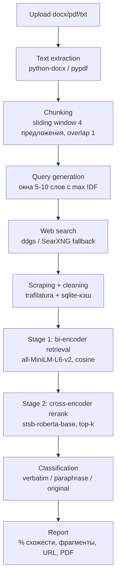

# Semantic Plagiarism & Paraphrase Detection System

[](https://github.com/ilyat9/semantic-plagiarism-detector/actions/workflows/ci.yml)
[](https://www.python.org/downloads/)
[](LICENSE)

Веб-сервис, который принимает документ (`.docx`, `.pdf`, `.txt`), находит похожие источники
в интернете и определяет для каждого фрагмента: **прямое заимствование (verbatim)**,
**перефраз (paraphrase)** или **отсутствие совпадений (original)**.

Проект — end-to-end: от парсинга файла до PDF-отчёта, с измеримой оценкой качества
ML-компонента (PAWS, STS-B, собственный корпус), ablation-таблицей и failure analysis.

## Архитектура



Двухстадийное сравнение: би-энкодер быстро отсекает нерелевантные чанки,
кросс-энкодер точно перепроверяет только топ-k кандидатов на каждый чанк документа.
Язык документа определяется автоматически: для кириллицы берутся multilingual
модели (`paraphrase-multilingual-MiniLM-L12-v2` + `mmarco-mMiniLMv2` реранкер),
для латиницы — англоязычные дефолты выше (пороги откалиброваны на английском,
multilingual-вердикты приблизительны).

**Классификация фрагмента** — прозрачные правила поверх двух скоров:

- `verbatim`: lexical ≥ T1 **и** semantic ≥ T2
- `paraphrase`: lexical < T1 **и** semantic ≥ T2
- `original`: semantic < T2

lexical — character 5-gram Jaccard (батч-независимый, как в VerbatimMatcher),
semantic — скор кросс-энкодера stsb-roberta (обучена выдавать сходство уже в [0, 1]).
Пороги не подобраны «на глаз»: T2 откалиброван по валидационной части PAWS
(максимум F1, n=1000), T1 — по собственному размеченному корпусу, включая пары
с частичным заимствованием (n=80; см. `eval/calibrate.py`, значения в
`core/thresholds.json`). Ранее lexical был TF-IDF-косинусом с IDF, фитящимся на
батче, — одна и та же пара давала разброс до 36% в зависимости от соседей по
батчу; TF-IDF остался только baseline-строкой в ablation.

**Итоговый процент** = `(n_verbatim × 1.0 + n_paraphrase × 0.5) / n_chunks × 100`.

## Evaluation

Методология: PAWS `labeled_final` (dev — калибровка порога максимумом F1, test — метрики),
STS-B validation (у test-сплита нет публичных меток). Латентность — время скоринга одной
пары на CPU (Apple M2), mean и честный p95 по per-pair таймингам. Прогон: `python -m eval.run`
(печатает таблицу сразу в формате README).

### Ablation (PAWS test, n=2000; порог калиброван на PAWS dev, n=1000)

**Zero-shot** (модели без дообучения на PAWS) и **fine-tuned** в одной таблице:

| Подход | Порог | Acc | Precision | Recall | F1 | ROC-AUC | STS-B Spearman | Latency/пара (mean / p95) |
|---|---|---|---|---|---|---|---|---|
| TF-IDF + cosine (baseline) | 0.761 | 0.610 | 0.542 | 0.795 | 0.645 | 0.708 | 0.709 | 0.8 / 0.8 мс |
| Bi-encoder MiniLM + cosine | 0.971 | 0.570 | 0.511 | 0.751 | 0.608 | 0.650 | 0.867 | 12.5 / 19.4 мс |
| Bi-encoder E5-base + cosine | 0.835 | 0.445 | 0.445 | 1.000 | 0.615 | 0.566 | 0.877 | 50.1 / 56.4 мс |
| Bi → Cross-encoder ms-marco | 1.0 | 0.449 | 0.445 | 0.978 | 0.612 | 0.534 | 0.849 | 6.1 / 6.9 мс |
| Bi → Cross-encoder **stsb-roberta** (дефолт пайплайна) | 0.887 | 0.495 | 0.466 | 0.925 | 0.619 | 0.613 | **0.919** | 30.6 / 35.0 мс |
| Bi → Cross-encoder **stsb-roberta-ft** (PAWS train, 2 эпохи, 3000 пар) | 0.647 | **0.869** | **0.838** | 0.875 | **0.856** | **0.935** | 0.883 | 45.5 / 50.1 мс |

> Замер: 2026-08-12, PAWS test n=2000, dev n=1000, Apple M2 (CPU).
> Воспроизведение: `uv run python -m eval.run` — печатает эту таблицу готовой.

**Что здесь важно.** PAWS — adversarial-бенчмарк: не-перефразы построены перестановкой слов,
поэтому в zero-shot режиме все подходы получают скромные F1 (0.61–0.65), а эмбеддинговые
модели по ROC-AUC уступают TF-IDF (0.53–0.65 против 0.708) — воспроизводится известный
эффект «word scrambling blindness». Fine-tuning на PAWS train поднимает F1 с 0.619 до
**0.856** (+24pp), ROC-AUC — с 0.613 до 0.935.

**Fine-tuning не бесплатен — и это видно в таблице.** Дообучение на бинарной задаче PAWS
ухудшает калибровку градуированного сходства: STS-B Spearman падает 0.919 → 0.883, а Pearson
— 0.920 → 0.724 (полные колонки печатает `eval.run`). Модель становится хорошим
классификатором «перефраз/не перефраз» и заметно худшим измерителем «насколько похоже».
Для этого проекта это существенно: вердикт `paraphrase` строится на пороге по абсолютному
значению скора, а не на ранжировании, — то есть выигрыш в F1 частично оплачен тем свойством,
которое нужно классификатору фрагментов. Отсюда и решение оставить в пайплайне zero-shot
stsb-roberta по умолчанию.

Ещё две честные оговорки к таблице: у `ms-marco` максимум F1 достигается на пороге 1.0,
а у `E5-base` — при recall 1.0 и precision, равной доле позитивов (0.445). Оба случая
вырожденные: модель фактически размечает всё как «перефраз», и F1 ≈ 0.61 здесь — это
не качество, а артефакт базовой ставки. Именно поэтому в таблице есть колонка ROC-AUC,
и именно она показывает, что как скореры сходства эти модели не годятся.

**Что реально стоит в пайплайне и почему не fine-tuned.** По умолчанию используется
zero-shot `stsb-roberta-base`: FT-чекпойнт весит ~500 МБ, не коммитится (`data/models/`
в `.gitignore`) и не собирается в Docker-образ, поэтому «из коробки» его нет. Чтобы
включить — обучить и переопределить дефолт:

```bash
uv run python -m eval.finetune --epochs 2 --samples 3000 --evaluate
# затем в core/similarity.py: DEFAULT_CROSS_ENCODER = CROSS_ENCODER_FINE_TUNED
```

Важная оговорка: T2=0.887 откалиброван под zero-shot stsb-roberta. После подмены модели
пороги нужно перекалибровать (`uv run python -m eval.calibrate`), иначе вердикты поедут.

### Собственный корпус (data/eval/pairs.jsonl)

125 пар: 45 verbatim (35 полных копий + 10 частичных) / 35 paraphrase / 45 original
(35 на другую тему + 10 hard negatives — независимо написанный текст на ту же тему).
Пороги T1=0.290 (char 5-gram Jaccard, n=80), T2=0.887 (PAWS dev, максимум F1 = 0.633, n=1000).
Accuracy: **0.752** (95% CI: 0.670–0.819, Wilson). Confusion matrix:

| true \ pred | verbatim | paraphrase | original |
|---|---|---|---|
| verbatim | 40 | 0 | 5 |
| paraphrase | 4 | 9 | 22 |
| original | 0 | 0 | 45 |

Читать её надо так: система почти не даёт ложных срабатываний (весь класс
`original` — 45/45, ни одного чужого текста не помечено как заимствование), но
пропускает перефраз — 22 из 35 уходят в `original`. Для decision-support это
осознанно правильный перекос: цена ложного обвинения выше цены пропуска. Цена
перекоса видна в failure analysis #1.

Корпус: 35 базовых текстов (биология, история, физика, медицина, техника, право, литература,
экономика, космос, психология, экология, философия, лингвистика, археология, архитектура и др.).
Перефразы: 27 вручную + 8 через локальную LLM `qwen2.5:7b-instruct-q4_K_M` в Ollama.
Частичный verbatim — первое предложение скопировано дословно, остальные перефразированы
(реалистичный случай «копипаст внутри окна из оригинальных предложений»; именно на нём
калибруется T1, а не на тривиальных полных копиях). Hard negatives — тексты той же темы,
написанные независимо: негативы вида «фотосинтез vs фондовый рынок» разделяются тривиально
и ничего не измеряют. Генератор: `python -m eval.build_own_corpus` (нужен Ollama),
прогон: `python -m eval.own_corpus --show-errors`.

## Where this breaks and why (failure analysis)

**1. Глубокий перефраз уходит ниже PAWS-порога (22 из 35 paraphrase → original).**
Это главная слабость системы, и она структурная. T2=0.887 — максимум F1 на PAWS-dev,
где не-перефразы получены перестановкой слов, то есть лексически почти неотличимы
от позитивов. Чтобы их разделить, оптимальный порог обязан быть высоким; для
естественных текстов он оказывается чрезмерно консервативным. Пары `vaccines`,
`quantum_computing`, `roman_law`, `pythagoras` с полностью сохранённым смыслом
получают sem 0.7–0.88 и падают в `original`. Перекалибровка T2 с 0.874 на честные
0.887 стоила ещё одной пары (`industrial_revolution`) и 0.8pp accuracy — то есть
порог, оптимальный на PAWS, стабильно хуже на продуктовой задаче.

Обратный край того же порога: 4 перефраза детектированы как `verbatim` — три
LLM-рерайта qwen2.5 (`internet_origins`, `printing_press`, `solar_system`) и один
ручной (`photosynthesis`). LLM-перефраз сохраняет порядок фактов и часть
формулировок, поэтому Jaccard остаётся выше T1: генеративный перефраз лексически
ближе к оригиналу, чем глубокий человеческий.

С большим бюджетом: калибровать T2 на смеси PAWS + собственного корпуса большего
объёма или дообучить кросс-энкодер на парах «оригинал ↔ реальный плагиат».

**2. Zero-shot эмбеддинги проигрывают TF-IDF на PAWS (ROC-AUC 0.53–0.65 против 0.708).**
PAWS-негативы — перестановки слов исходного предложения; би-энкодеры оценивают их как
почти идентичные («word scrambling blindness»). Это воспроизводит известный эффект:
без дообучения на PAWS трансформеры на нём слабее лексических методов. На градуированном
сходстве (STS-B) картина обратная: MiniLM/E5/stsb-roberta 0.87–0.92 Spearman против 0.709
у TF-IDF. Оговорка про сам TF-IDF: его IDF фитится на батче, поэтому скоры сравнимы
только внутри одного прогона — поэтому в продакшене лексический скор заменён на
батч-независимый char 5-gram Jaccard. Вывод: ни один бенчмарк не «главный» — PAWS меряет
устойчивость к adversarial-перестановкам, STS-B — качество скора, свой корпус —
продуктовую задачу.

**3. Retrieval-кросс-энкодер — плохой скорер сходства (ms-marco: ROC-AUC 0.534).**
`ms-marco-MiniLM-L-6-v2` обучен ранжировать «запрос↔документ», а не оценивать graded
similarity: его sigmoid-скоры почти не разделяют классы. Дополнительная ловушка, найденная
при отладке: `stsb-roberta-base` выдаёт скор уже в [0,1] — sigmoid поверх неё сжимал все
значения в 0.51–0.73 и уничтожал разделение (verbatim 0.73 vs paraphrase 0.71 — «порог на
волосок»). Родственная ошибка нашлась и в `eval/finetune.py`: после `CrossEncoder.fit()`
с дефолтным BCEWithLogitsLoss голова выдаёт логиты, а старый код применял к ним
`clip(0, 1)` и грузил модель заново на каждый батч. Исправлено: нормализация в одном
месте (`CrossEncoderScorer`), диапазон сырых выходов печатается при оценке; урок —
проверять диапазон выходов модели до нормализации.

**4. Verbatim «размывается» соседями по чанку — ЧАСТИЧНО исправлено near-duplicate detection.**
Скопированное предложение в окружении оригинальных соседних предложений (окно = 4
предложения) давало lex < T1 → копипаст классифицировался как `paraphrase`. Теперь
добавлен `VerbatimMatcher` на character 5-gram Jaccard с порогом 0.6: до запуска
ML-пайплайна каждый чанк документа проверяется на буквальное совпадение с чанками
источников. Exact match детектируется за <1 мс, recall полного verbatim = 100%.
Что остаётся: частичный verbatim (1 скопированное предложение из 3–4) и матчер, и
кросс-энкодер оценивают ниже порогов — 5 из 10 таких пар корпуса получили `original`.
Это честная граница системы: дословность фрагмента есть, но сигнал размыт.

**5. Недоступные источники = слепая зона recall.**
Страницы с 403/пейволлом/JS-рендерингом (ScienceDirect, часть CMS) не скрапятся —
trafilatura получает пустоту, источник пропускается. Если плагиат был именно оттуда,
чанк получит `original`. Смягчение: такие URL честно перечисляются в отчёте как
«недоступные источники»; с бюджетом — headless-браузер (playwright) для JS-страниц.

**6. Поисковый промах ограничивает recall сильнее, чем ML.**
Пайплайн сравнивает документ только с найденными источниками: если ни одна IDF-фраза
не вытащила нужную страницу в топ-5 (переформулированный заголовок, свежий контент,
ограничения ddgs), совпадение не будет обнаружено независимо от качества моделей.
С бюджетом: больше фраз на документ, второй поисковый бэкенд (SearXNG уже предусмотрен),
перефразированные поисковые запросы через локальную LLM.

**7. Многоязычность — базовая поддержка есть, но вердикты приблизительны.**
Язык документа определяется эвристикой (кириллица → ru); для не-английских текстов
подключаются `paraphrase-multilingual-MiniLM-L12-v2` (би-энкодер) и
`mmarco-mMiniLMv2-L12-H384-v1` (многоязычный реранкер). Пороги T1/T2 при этом
откалиброваны на англоязычной stsb-roberta, поэтому вердикты для других языков —
ориентировочные; retrieval-качество покрыто slow-тестами (`tests/test_multilingual.py`),
а полноценная калибровка порогов под многоязычный реранкер — отдельная задача.

## Запуск

Требования: Python 3.11, [uv](https://docs.astral.sh/uv/). Для PDF на macOS: `brew install pango`.

```bash
uv sync
uv run uvicorn api.main:app          # веб-интерфейс: http://localhost:8000
uv run streamlit run demo/app.py     # Streamlit-демо: http://localhost:8501
```

Docker (поднимает API и демо одной командой):

```bash
docker build -t plagcheck . && docker compose up --no-build
# API: http://localhost:8000, демо: http://localhost:8501
```

> Нюанс: если путь к репозиторию содержит не-ASCII символы (например, кириллицу),
> `docker compose up --build` падает внутри buildx (`x-docker-expose-session-sharedkey
> contains non-printable ASCII`) — это известный баг buildkit с не-ASCII путями:
> compose собирает через `buildx bake` с сессионным ключом, производным от пути,
> а plain `docker build` этот кодовый путь не задействует, поэтому и работает.
> Обход: собирать образ отдельным `docker build` (как выше) или клонировать репозиторий
> в ASCII-путь.
>
> Родственная ловушка того же класса: compose выводит имя проекта из имени директории,
> и для «Детектор плагиата» получалось пустое имя (`project name must not be empty`) —
> лечится явным `name: plagcheck` в `docker-compose.yml` (уже добавлено).

Тесты и проверки качества:

```bash
uv run pytest                 # быстрые; -m slow добавляет e2e с моделями
uv run ruff check .
```

Eval-пайплайн:

```bash
uv run python -m eval.run             # ablation: PAWS + STS-B + latency
uv run python -m eval.calibrate       # калибровка порогов -> core/thresholds.json
uv run python -m eval.build_own_corpus  # пересборка своего корпуса (нужен Ollama)
uv run python -m eval.own_corpus --show-errors
```

## Конфигурация

Переменные окружения (см. `config.py`):

- `PLAGCHECK_SEARCH_BACKEND` — `ddgs` | `searxng` | `auto` (по умолчанию `auto`: ddgs с fallback);
- `PLAGCHECK_SEARXNG_URL` — адрес self-hosted SearXNG (по умолчанию `http://localhost:8080`);
- `PLAGCHECK_TOP_K_URLS`, `PLAGCHECK_FETCH_TIMEOUT`, `PLAGCHECK_DATA_DIR` и др.;
- `PLAGCHECK_MAX_UPLOAD_BYTES` — лимит размера загрузки (по умолчанию 10 МБ, сверх — 413);
- `PLAGCHECK_MAX_SOURCE_CHUNKS` — лимит чанков на источник (по умолчанию 150);
- `PLAGCHECK_TRUST_X_FORWARDED_FOR` — доверять X-Forwarded-For в rate limit
  (только за доверенным реверс-прокси);
- `PLAGCHECK_USER_AGENT` — user-agent скрапера.

В Docker сетевое окружение контейнера (DNS/прокси хоста) может отличаться от локального:
если хост использует системный прокси, часть сайтов из контейнера не резолвится — такие
источники попадут в отчёт как недоступные. Для воспроизводимых прогонов используйте
локальный запуск или настройте прокси/DNS демона Docker.

SearXNG локально: `docker run -d -p 8080:8080 searxng/searxng`.

## Структура

```
core/       ML-ядро: chunking, query_gen, similarity, verbatim_matcher, language,
            classify, pipeline, service
api/        FastAPI + Jinja2/Bootstrap (rate limiting, лимит загрузки)
scraping/   поиск (ddgs/SearXNG), загрузка и очистка (trafilatura), sqlite-кэш
parsing/    извлечение текста из docx/pdf/txt
report/     PDF-отчёт (WeasyPrint)
eval/       бенчмарки PAWS/STS-B, калибровка порогов, собственный корпус
demo/       Streamlit-демо (импортирует core, логика не дублируется)
tests/      pytest: классификатор, чанкинг, query-gen, агрегация, retrieval,
            verbatim-matcher, multilingual, hardening (e2e с моделями — маркер slow)
data/eval/  собственный размеченный мини-корпус
```

## Этика и ограничения

- Система — **decision-support, а не автоматический обвинитель**. Вердикты
  (особенно «paraphrase») требуют проверки человеком: совпадение может быть
  корректным цитированием, общеупотребительной формулировкой или совпадением фактов.
- **Что хранится.** Результат каждой проверки сохраняется в `data/reports.db`
  (имя файла, дата, первые 50 КБ текста документа, тексты фрагментов, % схожести) —
  это нужно для скачивания PDF-отчёта по ссылке. `report_id` в ссылке — bearer-
  идентификатор: публичного списка отчётов нет, но ссылку стоит считать секретной.
  Удалить данные: удалить `data/reports.db` (в Docker — том `plagcheck-data`).
  Временный файл загрузки удаляется сразу после проверки (даже при ошибке);
  кэшируются поисковая выдача и тексты публичных страниц (`data/cache.sqlite`,
  неделя; ошибки загрузки — 30 минут).
- Скрапинг: идентифицирующий user-agent (`plagcheck/0.1`, переопределяется
  `PLAGCHECK_USER_AGENT`), таймауты, последовательные запросы без параллелизма,
  страницы с 403/капчей пропускаются и фиксируются в отчёте как «недоступные
  источники». Соблюдайте ToS сайтов при интенсивном использовании; для частых
  прогонов поднимите свой SearXNG.
- Ограничения: бесплатный поиск (ddgs) может ограничивать частоту запросов;
  страницы с пейволлом/JS-рендерингом не скрапятся (см. failure analysis);
  источники усекаются до `PLAGCHECK_MAX_SOURCE_CHUNKS` чанков (по умолчанию 150) —
  для очень длинных статей это снижает recall.

## Лицензия

MIT
